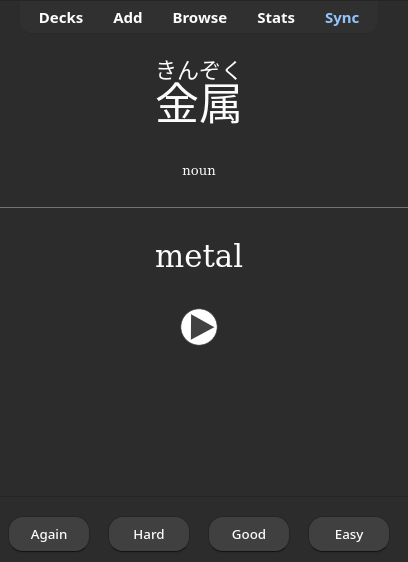

# Japanese Vocabulary Flashcards

_Generating flashcards for studying for the official Japanese Language Proficiency Test (JLPT)_

A script and Anki package for learning Japanese Language Vocabulary through flashcards.



Structured for the official Japanese Language Proficiency Test (JLPT). These flashcards are designed for use in a Spaced Repetition software such as [Anki](https://apps.ankiweb.net/). Anki helps manage when to review the flashcard according to how easy you found the question on the card. The flashcards are designed to help learn japanese vocabulary for all levels of Japanese, from beginners through to advanced native speaking.

# Use the deck now

## Anki Web

**Recommended approach**. To use the flashcards for learning straight away, head over to [JLPT-N5-N1 Japanese Vocabulary](https://ankiweb.net/shared/info/1550984460) and download Anki.

## Download files

Visit the [Latest Releases](https://codeberg.org/coolmule0/JLPT-N5-N1-Japanese-Vocabulary-Anki/releasesreleases/latest) to download the raw anki files. Useful for manual import. Download `Core Japanese Vocabulary Extended.apkg` for the anki-ready deck with audio, `Core Japanese Vocabulary.apkg` for the smaller version without audio (but same vocab), and `full.csv` for the tabular version of every card in the deck.

# Coding

The following is all related to the code for generating the deck.

## Installing

Clone the repository. Ensure you have python installed. Tested using python version 3.13. I would recommended installing the project dependencies in their own virtual environment:

``` bash
python -m venv env
source env/bin/activate  # Linux/Mac
source .\env\Scripts\activate   # or Windows
pip install -r requirements.txt
```

## Running

run `python createJLPTDeck.py`. This will generate a `.csv` and `.apkg` files in the `output` directory. The `.apkg` file is ready to be imported into Anki (use the "import from file" option). The two different `.apkg` files are the two different packages, one including audio (and hence a larger size). The `.csv` is a tabular format of each vocabulary card with all its associated information.

Audio is available from [Kanji Alive](https://kanjialive.com/). They provide archive dowloads of all audio files in different formats. Download the data type of choice (e.g. mp3), extract it into `original_data/kanji_alive/audio-mp3` or whatever file name it recommends. Then the audio is ready to be included in cards which match


## Developing & Contributing

In addition to the above requirements, also install `requirements-dev.txt` which contains typing and linting.


# Why this exists

I viewed the JLPT exams as a clear objective to study for. They are official, and they come in multiple levels starting from beginner so each stage is a small achievable objective. Also, Anki was commonly touted for studying foreign languages. I was drawn to the simplicity and efficacy of Anki, as well as its mature community with plentiful resources. I was able to find a flashcard deck from a book I was using to study (Genki 1 and 2), and straight away I was learning vocab from the book.

As I reached the end of Genki I wanted to continue the strong structured learning, and the JLPTs looked like a target to aim for. However, there was a lack of decent JLPT flashcard decks on Anki, or decks that followed a grading system. There were a few closed-source or paid methods, but as someone who loves open source and also a broke student, these felt beyond what I wanted to commit to as a hobby.

I figured a JLPT-based deck of a few thousand cards could be created programatically. I took lists of vocab within the JLTP, joined it with vocab word information, and made a programmable pipeline to be able to handle the thousands of flashcards that are needed for mastering the Japanese language.

I use these generated decks for my own vocabulary study, and aim to keep it relevant for both myself and others who use it. I want something focused - just JLPT, and to do it well. To be a correct and up-to-date resource for language study.

It's been a challenge figuring out a way to keep the process repeatable, yet make changes to cards and entries when they are incorrect or could do with improvement.

## Further ideas

There's always more I want to be doing with this. If you have some ideas you would like to see, drop a github issue, or Anki review.

An example extention idea is using one of the alternative JMDict language downloads. It isn't just english, containing multiple different languages. Can use the non-english meanings create a German-Japanese (say) language deck. 

# Data Information

More detailed information about the generated decks and `csv`s, the data sources used, and the card structure is available in the [data document](docs/data.md).

# Support
If you've found this deck and script useful, please consider leaving a small donation of your appreciation. Every little bit helps!

[](https://liberapay.com/JAC5/)
<a href='https://ko-fi.com/X8X01ODHQW' target='_blank'></a>
