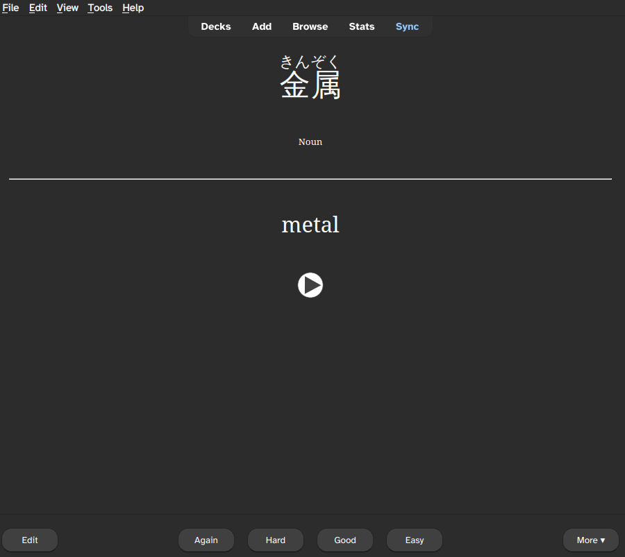

# Japanese Vocabulary Flashcards

_Generating flashcards for studying for the official Japanese Language Proficiency Test (JLPT)_

A script for creating Vocabulary Flashcards for learning Japanese Language Vocabulary. Flashcards have a question on one side and an answer on the other. For example "川" on one side and "river" on the other side. 




These particular flashcards are structured for the official Japanese Language Proficiency Test (JLPT). Flashcards, while a useful study tool by themselves, can enhance learning further by using a Spaced Repetition software such as [Anki](https://apps.ankiweb.net/), which helps manage when to review the flashcard according to how easy you found the question on the card. The flashcards are designed to help learn japanese vocabulary for all levels of Japanese, from beginners through to advanced native speaking.

The code stores and analyses various data sources to obtain vocabulary and difficulty information, combines them together, and converts it all into Anki-ready flashcards.

If you would like to use the flashcards, head over to [JLPT-N5-N1 Japanese Vocabulary](https://ankiweb.net/shared/info/1550984460) and [JLPT-N5-N1 Japanese Vocabulary Extended Notes](https://ankiweb.net/shared/info/336300824), two decks with easy instructions for use within Anki. Alternatively, visit the [Releases] (link to be added) to download the raw files.

If you would like to run the code yourself or make any programatic changes to the deck follow the instructions below to get set up.

# How to use it

## Installing

Clone the repository. Ensure you have python installed. Tested using python version 3.13. I would recommended installing the project dependencies in their own virtual environment:

``` bash
python -m venv env
source env/bin/activate  # Linux/Mac
source .\env\Scripts\activate   # or Windows
pip install -r requirements.txt
```

## Running

run `python createJLPTDeck.py`. This will generate a `.csv` and `.apkg` files in the `output` directory. The `.apkg` file is ready to be imported into Anki (use the "import from file" option). The two different `.apkg` files are the two different packages, one including audio (and hence a larger size). The `.csv` is a tabular format of each vocabulary card with all its associated information.

To download audio create a file `wanikani_token` in the root directory. It should contain a single line: your wanikani api key. The api requires token authentication for every call to wanikani.

## Developing

In addition to the above requirements, also install `requirements-dev.txt` which contains typing and linting.

# Why it exists

I viewed the JLPT exams as a clear objective to study for. They are official, and they come in multiple levels starting from beginner so each stage is a small achievable objective. Also, Anki was commonly touted for studying foreign languages. I was drawn to the simplicity and efficacy of Anki, as well as its mature community with plentiful resources. I was able to find a flashcard deck from a book I was using to study (Genki 1 and 2), and straight away I was learning vocab from the book.

As I reached the end of Genki I wanted to continue the strong structured learning, and the JLPTs looked like a target to aim for. However, there was a lack of decent JLPT flashcard decks on Anki, or decks that followed a grading system. There were a few closed-source or paid methods, but as someone who loves open source and also a broke student, these felt beyond what I wanted to commit to as a hobby.

I figured a JLPT-based deck of a few thousand cards could be created programatically. I took lists of vocab within the JLTP, joined it with vocab word information, and made a programmable pipeline to be able to handle the thousands of flashcards that are needed for mastering the Japanese language.

I use these generated decks for my own vocabulary study, and aim to keep it up-to-date and relevant for both myself and others who use it. I want something focused - just JLPT, and to do it well. To be a correct and up-to-date resource for language study.

## Further ideas

There's always more I want to be doing with this. If you have some ideas you would like to see, drop a github issue, or Anki review.

An example extention idea is using one of the alternative JMDict language downloads. It isn't just english, containing multiple different languages. Can use the non-english meanings create a German-Japanese (say) language deck. 

# Misc

## Data sources

JLPT resources are primarily found from [Jonathan Waller‘s JLPT list](https://www.tanos.co.uk/jlpt/). This resource is used for the online dictionary [Jisho](https://jisho.org) as well as derivatives such as [JLPT Sensei](https://jlptsensei.com/).

Japanese vocabulary information is gathered from the [JMDict, Japanese dictionary database](https://www.edrdg.org/jmwsgi/srchformq.py?svc=jmdict), a really good machine-friendly resoruce with a community helping to keep it up to date and evolving. The database is available for download. In particular, I use the unofficial json-formatted version https://github.com/scriptin/jmdict-simplified as I find json easier to parse myself. If you want to use a more up-to-date version of the dictionary. Download the json version you want from their releases, and point the `jmdict extract` function to the zip for it to use instead of the provided one.

Audio is scraped from Wanikani. It requires a user-provided auth token in a `wanikani_token` file. It uses their human audio samples.

## Information about the generated package

### The `.apkg` deck structure

The increasing vocabulary structure of JLPT lends itself well to a simple heirarchy:

- JLPT N1 (3056 cards)
	- JLPT N2 (1724 cards)
		- JLPT N3 (1591 cards)
			- JLPT N4 (613 cards)
				- JLPT N5 (625 cards)

With N5 as the easiest, and N1 being the hardest. This structure means every grade below it is also included in the review list. So studying N3 also includes the vocabulary studied for N4 and N5.

To achieve this in Anki start by creating an empty deck of the above form. The quickest way to do this is create a new deck called `Core Japanese Vocabulary::JLPT N2::JLPT N3::JLPT N4::JLPT N5`. The "::" in Anki means subdeck.

### Card layout

By default each vocabular word has two cards in the deck, "recognition" and "recall". Recognition provides the Japanese and asks for the English, while recall shows the English and asks for the equivalent Japanese word. I personally find recall useful for the initial stages of study, but becomes less relevant for the higher grades. Check out online resources for information if you don't want to study one of the two types of card.

The appearance of the flashcards is controled by the `card_style` folder, which contains `html` and `css` styling. These control what fields are displayed where, and how they should appear.

I've created a custom furigana-toggle style which hides and shows the furigana of the word when click/tapped. Furigana is the helpful hiragana shown in small above kanji to explain how to pronounce the word. Feel free to take this .css file for your own uses.

### Note Structure

Each flashcard in the deck contains the following elements:

| Field | Explanation |
| --- | --- |
|"Expression" | The word/expression in japanese with only kanji if relevant
| "English definition" | The main english meaning, translated
| "Reading" | Similar to "expression", but with kanji expanded with ruby-ready furigana addition
| "Grammar" | The grammatical usage of the word |
| "Additional definitions" | Other english meanings
| ("Sound") | (Optional: audio pronunciation of the word. Only used for `extended` deck type) |
| "tags" | See the table below. Includes JLPT grade, formality, and other relevant grouping to easily manipulate multiple cards. |


### The card tags

Each card/vocabulary-word has various possible tags.

| Tag category | Tag on card | Explanation |
|---|---|---|
|JLPT level | N5, N3, etc | The difficulty grade. Only one. Always included. |
|Formality | Polite, Humble, Honourific | If the word is used in a particular form of japanese speech. |
|Archaic word | Rare | A word that is rarely used, yet still considered part of the vocabulary. |
| Usually kana | usually_kana | Word is usually seen in kana form, though a kanji form does exist. |


## Support
If you've found this deck and script useful, please consider leaving a small donation of your appreciation. Every little bit helps!

[](https://liberapay.com/JAC5/)
<a href='https://ko-fi.com/X8X01ODHQW' target='_blank'></a>
